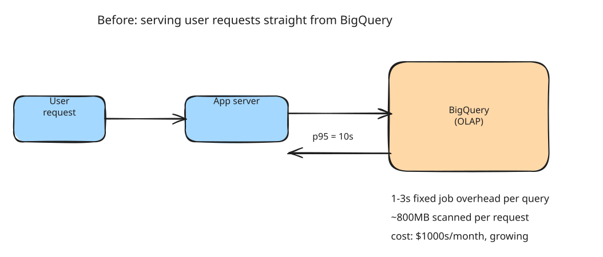
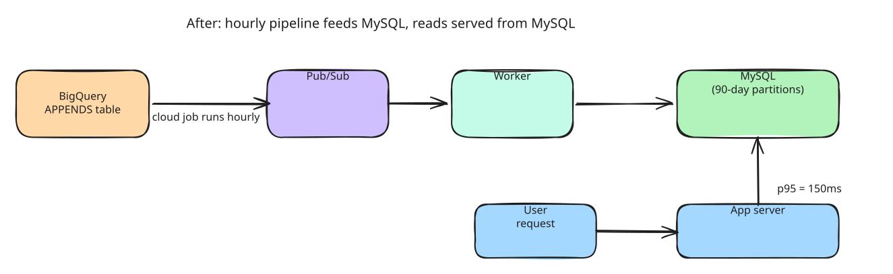
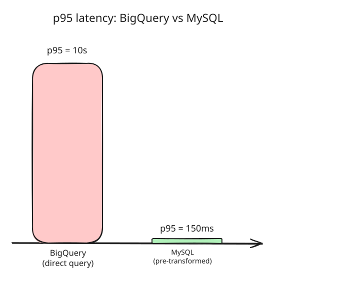

Engineers start greenfield projects with the intent of getting user feedback quickly, often using technology that is easier to work with. That is how it should be.

This is what we did internally with one of our products. We started using bigquery because we could get away with it. The product was new, the plumbing required was minimal. Made sense. We knew it would support the volume of data.

But as this product grew, we began seeing the issues. Cost and performance were telling us that something needed to be better. Maybe performance more than cost, the cost was just a sliver of the product's margin, but still, meaningful in absolute terms.

## The issues

- the latency for serving user requests was usually over 5 seconds
- the cost to serve these requests was in the thousands of dollars per month range, and would only increase with time

Bigquery is not the ideal store to keep data that is needed for user facing requests. Every time we make a query, there is a fixed 1-3s overhead of just creating the job that executes this query. Additionally, each request we were making scanned far more data than it needed, adding to the cost.

For those unfamiliar with how bigquery works under the hood, it separates compute from storage. So every time you query, it needs to allocate computational units called slots and execute the workload in parallel. It manages the dependencies between the slots and the whole job. This takes time.

Also bigquery doesn't have a traditional index like relational databases. The best it can do is partitions and clustering. Volume of data scanned depends on the data, and how well the partitions and clustering support the query pattern. In our case, the data scanned was around 800mb on average.

The request we were trying to improve populated some parts of the users dashboards with a summary of how their listings were doing. And this request had a p95 of 10s, leading to a bad user experience when opening the product dashboard.

## We could do better.

We knew we had to use an OLTP system, we gave some thought to the options available - firestore, google hosted mysql/postgres, but we went for mysql within our own Digital Ocean cluster. We have a team that already manages mysql servers for us, so getting it commissioned was fast and simple. They would also manage it for us. Our engineers work with mysql every day, they are familiar with it. It ticked all the boxes.

### Why OLTP?

We want to scan the least amount of data in the fastest way possible. We don't have major analytical queries over a large number of rows. The data for user queries doesn't need all the data since the inception of the product, it needs the last 90 days of data, in fact, only a fraction of the last 90 days of data. With these facts, we concluded that transforming the data before storing it in mysql would be the ideal case, and we went for it.

So we set up a pipeline to read from Bigquery APPENDS table. The appends table is a small table that exposes the change history of a table. It allows us to query recent data cheaply. If we had used the actual table for the query - we wouldn't have gotten any cost savings at all.

A cloud job runs once an hour - reads from the APPENDS table, and writes rows into a Pub/Sub. A worker running on our infra reads from the Pub/Sub, transforms the message and creates the rows we need in mysql.

The hour of added latency is fine. The delay to user is still acceptable, and under the SLO we target, in this case 48h. Another reason we were using Bigquery was that this dataset is huge, and we were not sure if bare mysql would be able to handle this load. So we ended up using mysql partitions and dropping older partitions to keep the table size under control.

The end result was that our user queries went from a p95 of 10s to 150ms.

